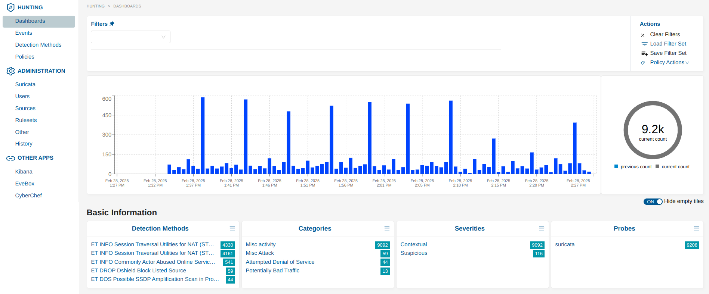
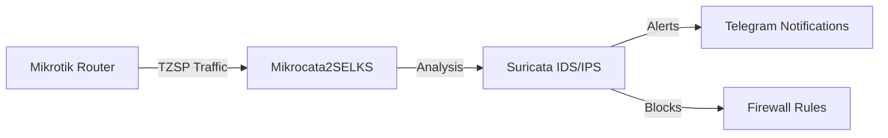
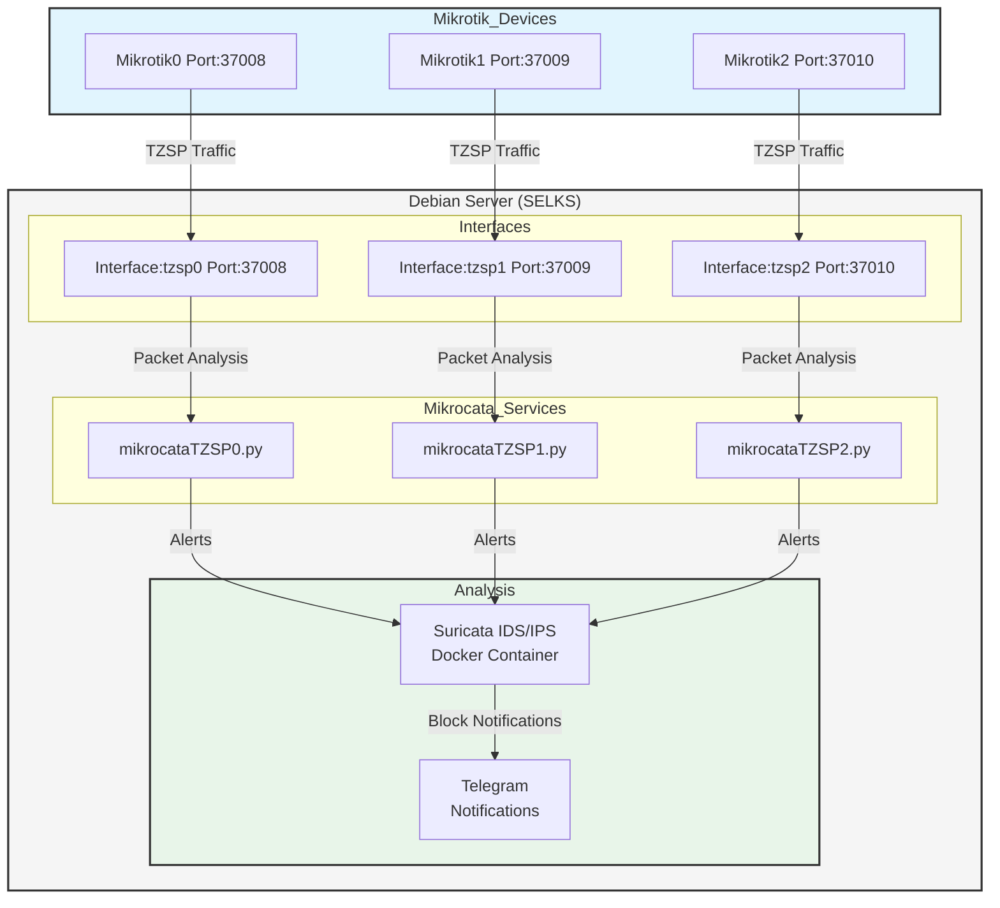

<h1 align="center">Welcome to Mikrocata2SELKS 👋</h1>
<p>
  
  <a href="https://github.com/angolo40/mikrocata2selks" target="_blank">
    
  </a>
</p>




## 📋 Introduction

Mikrocata2SELKS is a streamlined solution for integrating Mikrotik devices with Suricata IDS/IPS for packet analysis.
It automates the setup process and enables efficient network traffic monitoring and threat detection.
The script is compatible with latest SELKS 10.



**Minimum Requirements:**
- 4 CPU cores
- 10 GB of free RAM
- Minimum 10 GB of free disk space (actual disk usage will mainly depend on the number of rules and the amount of traffic on the network - 200GB+ SSD grade recommended).

## 📚 Documentation
For a comprehensive step-by-step installation guide with detailed explanations, screenshots, and troubleshooting tips, please visit:
[Complete Installation Guide](https://www.sec-ttl.com/mikrocata2selks-integrating-mikrotik-with-suricata-for-network-security/)

## 🚀 Installation

1. Set up a fresh Debian 12 installation on a dedicated machine (server or VM).
2. Log in as root.
3. Install Git: `apt install git`.
4. Clone this repository: `git clone https://github.com/angolo40/mikrocata2selks.git`.
5. Edit `easyinstall.sh` with the path where to install SELKS and the number of Mikrotik devices to handle.
6. Run `./easyinstall.sh`.
7. Wait....
8. Once finished, edit `/usr/local/bin/mikrocataTZSP0.py` with your Mikrotik and Telegram parameters, then reload the service with `systemctl restart mikrocataTZSP0.service`.
9. Configure your Mikrotik devices.

## 📡 Mikrotik Setup

1. Enable sniffer:
    ```sh
    /tool/sniffer/set filter-stream=yes streaming-enabled=yes streaming-server=[YOURDEBIANIP]:37008
    /tool/sniffer/start
    ```
2. Add firewall rules:
    ```sh
    /ip/firewall/raw/add action=drop chain=prerouting comment="IPS-drop_in_bad_traffic" src-address-list=Suricata
    /ip/firewall/raw/add action=drop chain=prerouting comment="IPS-drop_out_bad_traffic" dst-address-list=Suricata
    /ipv6/firewall/raw/add action=drop chain=prerouting comment="IPS-drop_in_bad_traffic" src-address-list=Suricata
    /ipv6/firewall/raw/add action=drop chain=prerouting comment="IPS-drop_out_bad_traffic" dst-address-list=Suricata
    ```
3. Enable Mikrotik API:
   You have two options:
   - For SSL connection (recommended):
    ```sh
    /ip/service/set api-ssl address=[DEBIANIP]
    ```
   - For non-SSL connection (default settings):
    ```sh
    /ip/service/set api address=[DEBIANIP]
    ```
   
   Then configure the corresponding settings in mikrocata.py:
   ```python
   USE_SSL = True  # Set to False for non-SSL connection
   PORT = 8728    # Default port for non-SSL. Will use 8729 if USE_SSL is True
   ALLOW_SELF_SIGNED_CERTS = False  # Set to True only if using self-signed certificates
   ```
4. Add Mikrocata user in Mikrotik:
    ```sh
    /user/add name=mikrocata2selks password=xxxxxxxxxxxxx group=full (change password)
    ```

## 🛠️ Handling Multiple Mikrotik Devices

By configuring the `easyinstall.sh` file to manage more than one Mikrotik device, the setup script will automatically create dedicated dummy interfaces and corresponding Mikrocata services for each device on the Debian machine.

- Example configuration:
    - For Mikrotik0: Creates the `tzsp0` interface on port `37008` and the script `/usr/local/bin/mikrocataTZSP0.py`.
    - For Mikrotik1: Creates the `tzsp1` interface on port `37009` and the script `/usr/local/bin/mikrocataTZSP1.py`.
    - For Mikrotik2: Creates the `tzsp2` interface on port `37010` and the script `/usr/local/bin/mikrocataTZSP2.py`.

You will need to edit each script with the specific Mikrotik values and enable the sniffer on each Mikrotik device to send data to the corresponding port.
The system architecture for handling multiple Mikrotik devices is designed to be modular and scalable. Here's a visual representation of how the system works:



## 💡 Features

- Installs Docker and Docker Compose.
- Installs Python.
- Downloads and installs SELKS repository (https://github.com/StamusNetworks/SELKS).
- Downloads and installs Mikrocata.
- Installs TZSP interface.
- Enables notifications over Telegram when an IP is blocked.

## 🔄 Changelog

- View CHANGELOG.md

## 🔧 Troubleshooting

- Check if packets are arriving at the VM from Mikrotik through the dummy interface:
    ```sh
    tcpdump -i tzsp0
    ```
- Check if mikrocata service and tzsp0 interface are up and running:
    ```sh
    systemctl status mikrocataTZSP0.service
    systemctl status TZSPreplay37008@tzsp0.service
    ```
- Check if Suricata Docker container is up and running:
    ```sh
    docker logs -f suricata
    ```
    if suricata shows 'Fatal glibc error: CPU does not support x86-64-v2' and you are under Proxmox Ve, please set CPU processor to HOST


## 📝 Notes
- Default account for SELKS:
    - URL: `https://[YOURDEBIANIP]`
    - Username: `selks-user`
    - Password: `selks-user`

## 👤 Author

**Giuseppe Trifilio**

- [Website](https://github.com/angolo40/mikrocata2selks)
- [GitHub](https://github.com/angolo40)

Inspired by [zzbe/mikrocata](https://github.com/zzbe/mikrocata).

## 🤝 Contributing

Contributions, issues, and feature requests are welcome! Check the [issues page](https://github.com/angolo40/mikrocata2selks).

## 🌟 Show Your Support

Give a ⭐️ if this project helped you!

- **XMR**: `87LLkcvwm7JUZAVjusKsnwNRPfhegxe73X7X3mWXDPMnTBCb6JDFnspbN8qdKZA6StHXqnJxMp3VgRK7DcS2sgnW3wH7Xhw`
