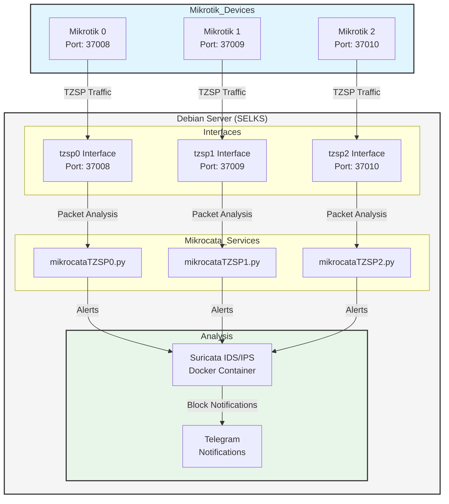

<h1 align="center">Welcome to Mikrocata2SELKS 👋</h1>
<p>
  
  <a href="https://github.com/angolo40/mikrocata2selks" target="_blank">
    
  </a>
</p>

## 📋 Introduction

This repository is designed to simplify the installation process for the IDS/IPS Suricata for packet analysis from Mikrotik devices. The script is compatible with latest SELKS 10.

**Minimum Requirements:**
- 4 CPU cores
- 10 GB of free RAM
- Minimum 10 GB of free disk space (actual disk usage will mainly depend on the number of rules and the amount of traffic on the network - 200GB+ SSD grade recommended).

## 🚀 Installation

1. Set up a fresh Debian 12 installation on a dedicated machine (server or VM).
2. Log in as root.
3. Install Git: `apt install git`.
4. Clone this repository: `git clone https://github.com/angolo40/mikrocata2selks.git`.
5. Edit `easyinstall.sh` with the path where to install SELKS and the number of Mikrotik devices to handle.
6. Run `./easyinstall.sh`.
7. Wait....
8. Once finished, edit `/usr/local/bin/mikrocataTZSP0.py` with your Mikrotik and Telegram parameters, then reload the service with `systemctl restart mikrocataTZSP0.service`.
9. Configure your Mikrotik devices.

## 📡 Mikrotik Setup

1. Enable sniffer:
    ```sh
    /tool/sniffer/set filter-stream=yes streaming-enabled=yes streaming-server=[YOURDEBIANIP]:37008
    /tool/sniffer/start
    ```
2. Add firewall rules:
    ```sh
    /ip/firewall/raw/add action=drop chain=prerouting comment="IPS-drop_in_bad_traffic" src-address-list=Suricata
    /ip/firewall/raw/add action=drop chain=prerouting comment="IPS-drop_out_bad_traffic" dst-address-list=Suricata
    /ipv6/firewall/raw/add action=drop chain=prerouting comment="IPS-drop_in_bad_traffic" src-address-list=Suricata
    /ipv6/firewall/raw/add action=drop chain=prerouting comment="IPS-drop_out_bad_traffic" dst-address-list=Suricata
    ```
3. Enable Mikrotik API:
    ```sh
    /ip/service/set api-ssl address=[DEBIANIP] enabled=yes
    ```
4. Add Mikrocata user in Mikrotik:
    ```sh
    /user/add name=mikrocata2selks password=xxxxxxxxxxxxx group=full (change password)
    ```

## 🛠️ Handling Multiple Mikrotik Devices

By configuring the `easyinstall.sh` file to manage more than one Mikrotik device, the setup script will automatically create dedicated dummy interfaces and corresponding Mikrocata services for each device on the Debian machine.

- Example configuration:
    - For Mikrotik0: Creates the `tzsp0` interface on port `37008` and the script `/usr/local/bin/mikrocataTZSP0.py`.
    - For Mikrotik1: Creates the `tzsp1` interface on port `37009` and the script `/usr/local/bin/mikrocataTZSP1.py`.
    - For Mikrotik2: Creates the `tzsp2` interface on port `37010` and the script `/usr/local/bin/mikrocataTZSP2.py`.

You will need to edit each script with the specific Mikrotik values and enable the sniffer on each Mikrotik device to send data to the corresponding port.
The system architecture for handling multiple Mikrotik devices is designed to be modular and scalable. Here's a visual representation of how the system works:



## 💡 Features

- Installs Docker and Docker Compose.
- Installs Python.
- Downloads and installs SELKS repository (https://github.com/StamusNetworks/SELKS).
- Downloads and installs Mikrocata.
- Installs TZSP interface.
- Enables notifications over Telegram when an IP is blocked.

## 🔄 Changelog
### 2.2.3
- Added IPV6Support (thanks floridan95)
  
### 2.2.2
- Fixed telegram notification issue.

### 2.2.1
- Fixed bug causing `mikrocata.py` script crash during Suricata logrotate.

### 2.2
- Added compatibility with Debian 12.

### 2.1
- Improved stability of the `read_json` function (thanks to bekhzad-khamidullaev).

## 🔧 Troubleshooting

- Check if packets are arriving at the VM from Mikrotik through the dummy interface:
    ```sh
    tcpdump -i tzsp0
    ```
- Check if mikrocata service and tzsp0 interface are up and running:
    ```sh
    systemctl status mikrocataTZSP0.service
    systemctl status TZSPreplay37008@tzsp0.service
    ```
- Check if Suricata Docker container is up and running:
    ```sh
    docker logs -f suricata
    ```

## 📝 Notes
- Default account for SELKS:
    - URL: `https://[YOURDEBIANIP]`
    - Username: `selks-user`
    - Password: `selks-user`

## 👤 Author

**Giuseppe Trifilio**

- [Website](https://github.com/angolo40/mikrocata2selks)
- [GitHub](https://github.com/angolo40)

Inspired by [zzbe/mikrocata](https://github.com/zzbe/mikrocata).

## 🤝 Contributing

Contributions, issues, and feature requests are welcome! Check the [issues page](https://github.com/angolo40/mikrocata2selks).

## 🌟 Show Your Support

Give a ⭐️ if this project helped you!

- **XMR**: `87LLkcvwm7JUZAVjusKsnwNRPfhegxe73X7X3mWXDPMnTBCb6JDFnspbN8qdKZA6StHXqnJxMp3VgRK7DcS2sgnW3wH7Xhw`
